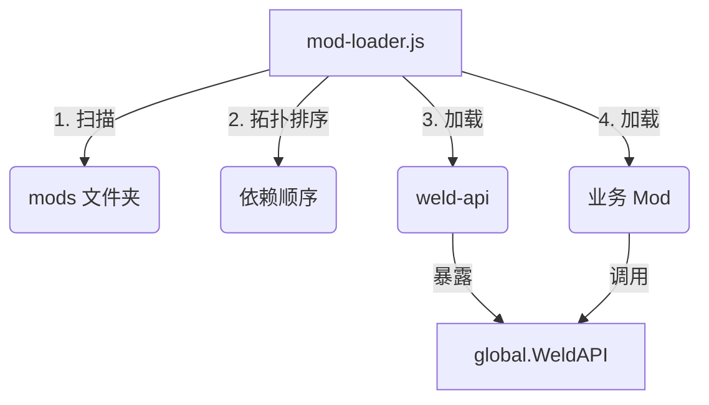

# 🧩 VSenv Weld Mod Loader 开发文档  
**版本：** v1.0  
**组件：** `weld-api` v2.1.0 + `mod-loader.js` v1.0.0  

---

## 1. 快速索引
| 文档 | 链接 |
|---|---|
| API 速查表 | [§3 API 速查表](#3-api-速查表) |
| 快速上手 | [§4 创建你的第一个 Mod](#4-创建你的第一个-mod) |
| 完整示例 | [§7 完整示例仓库](#7-完整示例仓库) |

---

## 2. 架构总览


---

## 3. API 速查表
| 名称 | 签名 | 说明 |
|---|---|---|
| 日志 | `WeldAPI.log(...args)` | 带前缀的统一日志 |
| 配置读取 | `WeldAPI.readUserSetting(key)` | 读取 `~/.vsenv/work/data/user/settings.json` |
| 通知 | `WeldAPI.showBalloon(title, body)` | 主进程级系统通知 |
| 事件总线 | `WeldAPI.on / emit` | Node.js `EventEmitter` 封装 |

---

## 4. 创建你的第一个 Mod

### 4.1 目录结构
```
mods/
└── hello-mod/
    ├── package.json
    └── out/
        └── extension.js
```

### 4.2 package.json（必需字段）
```json
{
  "name": "hello-mod",
  "version": "1.0.0",
  "main": "out/extension.js",
  "type": "module",
  "weld-dependencies": {
    "weld-api": "*"
  }
}
```

### 4.3 extension.js
```js
export function activate() {
  console.log('[Hello Mod] Activated successfully');
  global.WeldAPI.showBalloon('Hello Mod', '你好，世界！');
}
```

---

## 5. 依赖与加载顺序

### 5.1 声明依赖
在 `package.json` 中列出 `weld-dependencies` 即可；支持任意字符串版本号（语义化版本检查为可选）。

```json
"weld-dependencies": {
  "weld-api": "2.x",
  "some-other-mod": "1.2.3"
}
```

### 5.2 拓扑排序
mod-loader 会自动将 mods 按 **拓扑顺序** 加载，避免循环依赖。  
若出现环，将抛出：`Circular dependency detected involving xxx`。

---

## 6. 事件总线（EventBus）

```js
// 监听
WeldAPI.on('theme-changed', newTheme => {
  console.log('主题已切换为', newTheme);
});

// 触发
WeldAPI.emit('theme-changed', 'dark');
```

---

## 7. 调试与常见问题

| 问题 | 原因 | 解决 |
|---|---|---|
| `[WML] Mod xxx must declare 'weld-dependencies'` | 缺少声明 | 在 package.json 添加 `"weld-dependencies": { "weld-api": "*" }` |
| `Error mutex already exists` | 上一次 VS Code 未正常退出 | 删除 `%APPDATA%\Code\*.lock` 后重启 |
| `activate` 未执行 | 未导出 `activate` 函数 | 确保 `export function activate() {}` |

---

## 8. 贡献与规范
- 所有日志请使用 `WeldAPI.log(...)` 便于统一格式。
- 发布前请运行 `npm run lint && npm run test`（示例脚本在仓库中）。
- Pull Request 需附带 `CHANGELOG.md` 条目。

---

## 9. 许可证
MIT © VSenv Team